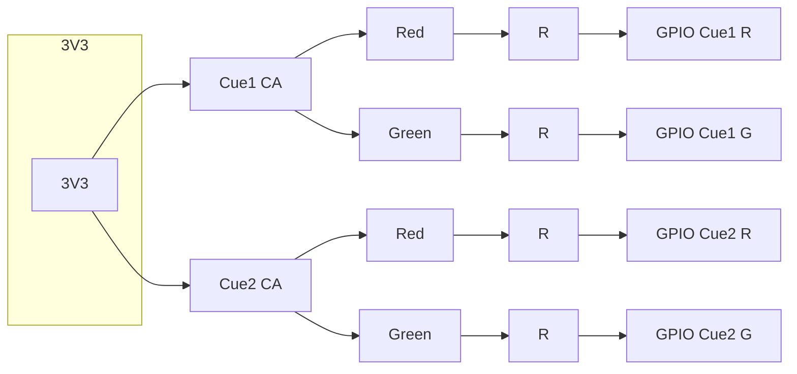

# Pinout

Firmware pin map as of **v1.3.0**. Source of truth: `config.h`.

Cue lamps are **common-anode RGB**. GPIO **LOW** turns a color on (current sink). Buttons are **active LOW** (to GND) with internal pull-up.

Onboard status LEDs are separate from the cue lamps (see each board).

---

## NodeMCU v2 (ESP8266)

Default target. FQBN: `esp8266:esp8266:nodemcuv2`.

| Function | NodeMCU | GPIO | Notes |
|----------|---------|------|--------|
| Cue 1 button | D1 | 5 | Hold 3 s at boot to wipe WiFi |
| Cue 2 button | D2 | 4 | |
| Cue 1 red | D5 | 14 | RGB cathode; LOW = on |
| Cue 1 green | D6 | 12 | RGB cathode; LOW = on |
| Cue 2 red | D7 | 13 | RGB cathode; LOW = on |
| Cue 2 green | D8 | 15 | RGB cathode; LOW = on |
| Status LED | D4 | 2 | Onboard; **active LOW**. On when Cue 1 is green |

NodeMCU **3V3** feeds both RGB common anodes.

---

## Heltec WiFi LoRa 32 V3 (ESP32-S3)

Selected automatically with FQBN `esp32:esp32:heltec_wifi_lora_32_V3` (or `-DBOARD_HELTEC_V3`).

Firmware default is `CUE_LOCAL_ONE`: OLED shows one full-width Cue 1 box; **PRG** toggles Cue 1. GPIO 2 (Cue 2 button) is unused. `CUE_LOCAL_TWO` remaps PRG to Cue 2; `CUE_LOCAL_ALL` restores both boxes and both buttons. WiFi wipe always uses the physical **PRG** button (3 s hold while lamps blink at boot). Hold **PRG for 3 seconds** during normal operation to deep-sleep (`-OFF-`); a short press wakes.

### Cue I/O (header)

| Function | GPIO | Notes |
|----------|------|--------|
| Cue 1 button | 0 | Onboard **PRG**. Active LOW. WiFi wipe: after OLED splash, hold 3 s while lamps blink (8 s window). Do not hold at reset (flash download). After boot, 3 s hold is power-off. `CUE_LOCAL_TWO` maps this pin to Cue 2 instead. |
| Cue 2 button | 2 | Header; unused unless `CUE_LOCAL_ALL` (or `CUE_LOCAL_TWO`, which maps Cue 1 onto this pin) |
| Cue 1 red | 4 | RGB cathode; LOW = on |
| Cue 1 green | 5 | RGB cathode; LOW = on |
| Cue 2 red | 6 | RGB cathode; LOW = on |
| Cue 2 green | 7 | RGB cathode; LOW = on |
| Status LED | 35 | Onboard; **active HIGH**. On when the local cue is green |

GPIO 4–7 are consecutive header pins, free of LoRa, OLED, and USB. Heltec **3V3** feeds both RGB common anodes.

### Onboard (firmware-owned)

| Function | GPIO | Notes |
|----------|------|--------|
| Battery ADC | 1 | ADC1_CH0 via 100 kΩ / 390 kΩ divider |
| OLED SDA | 17 | SSD1306, address `0x3C` |
| OLED SCL | 18 | |
| OLED RST | 21 | |
| Vext | 36 | **Active LOW**. Powers OLED and `Ve` header pins |
| Battery ADC_CTRL | 37 | Connects the VBAT divider (polarity probed at boot) |
| UART0 TX | 43 | USB serial (CP2102) |
| UART0 RX | 44 | USB serial (CP2102) |

### Onboard LoRa (SX1262)

Firmware owns these pins. RadioLib talks to the SX1262 when **Enable LoRa** is on in `/setup`. Do not wire lamps or buttons here. Frequency is **915.0 MHz** plus `LoRa Channel` × 0.2 MHz (channel 0–7). DIO2 is used internally as the RF switch (not a header GPIO).

| GPIO | LoRa signal |
|------|-------------|
| 8 | NSS (SPI CS). Held HIGH in power-off. |
| 9 | SCK |
| 10 | MOSI |
| 11 | MISO |
| 12 | RESET. Held LOW in power-off. |
| 13 | BUSY |
| 14 | DIO1 (packet IRQ) |

### Do not use

| GPIO | Taken by |
|------|----------|
| 19 | USB D− |
| 20 | USB D+ |
| 45, 46 | Strapping pins |

Spare header GPIOs: **47**, **48**.

---

## Schematic — common-anode RGB (two cues)

These are 5 mm 4-lead **RGB common-anode** beads. The longest lead is the common anode. Typical order, lens toward you, leads down:

```
  [ R ]  [ CA ]  [ G ]  [ B ]
 short  longest
```

Confirm with a diode tester if the pin order differs — cheap RGB LEDs often have **R and G leads swapped** relative to the label. Wire by color observed, not lead position alone. **Blue is unused** (leave open). Firmware only drives red or green, never both.

**Do not tie the common anode to 5 V.** GPIOs are 3.3 V. If the anode is at 5 V, red will glow dimly even when the GPIO is HIGH. Use the board **3V3** rail.

Each cathode gets one of the kit current-limit resistors (typically 220 Ω–1 kΩ, ¼ W).

```
                         3V3
                          |
          +---------------+---------------+
          |                               |
         CA                              CA          longest lead
        / | \                           / | \
       R  G  B                         R  G  B
       |  |  x (nc)                    |  |  x (nc)
      [R][R]                          [R][R]         kit resistors
       |  |                            |  |
     GPIO GPIO                       GPIO GPIO
     Cue1 Cue1                       Cue2 Cue2
      R    G                          R    G
```

| Cue | Red cathode | Green cathode | Common anode | Blue |
|-----|-------------|---------------|--------------|------|
| 1 | NodeMCU D5 / Heltec GPIO 4 | NodeMCU D6 / Heltec GPIO 5 | 3V3 | no connect |
| 2 | NodeMCU D7 / Heltec GPIO 6 | NodeMCU D8 / Heltec GPIO 7 | 3V3 | no connect |

Drive: GPIO **LOW** sinks current through the resistor and LED; GPIO **HIGH** is high-Z/3.3 V and the LED is off.



Buttons (not shown): each GPIO to a momentary switch to **GND**. Internal pull-ups are enabled in firmware.
